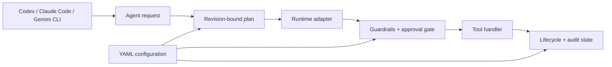

<div align="center">

# Agent Template

### A model-agnostic, security-conscious harness for governed AI agents

[](https://github.com/qelu/agent-template/actions/workflows/ci.yml)


[](LICENSE)

Build small agents with explicit authority, revision-bound plans, auditable
capabilities, and portable host configuration.

</div>

> [!IMPORTANT]
> Version 0.1.0 is an early public release. The governance core and deterministic
> reference adapter are implemented and tested. Provider SDK runtime adapters are
> extension points, not production-ready integrations.

## What this is

Agent Template is a Python foundation for agents whose behavior is constrained by
code and configuration—not only by prompts. It separates a provider-neutral runtime
contract from host-specific setup, then places policy checks around every tool call.

It is intended for developers who want a legible starting point for building agents
without coupling their governance model to one model vendor or agent application.

## Key features

| Capability | What it provides |
| --- | --- |
| Model-neutral boundary | A common request/result interface; provider details stay in adapters. |
| Exact-scope approvals | Approval is bound to an action, normalized arguments, risk, plan revision, and expiry. |
| Guardrails | Declarative allowlists, risk levels, argument constraints, and approval requirements. |
| Revision-bound plans | Materially changed work requires a new plan revision and fresh approval. |
| Lifecycle controls | Prepare, execute, validate, complete, fail, recover, and clean up with persisted state. |
| Capability governance | Scaffold, evaluate, activate, detect drift, deprecate, roll back, and audit extensions. |
| Multi-host initialization | Generate portable, Codex, Claude Code, or Gemini CLI projects. |
| Current documentation | Configure official-documentation access appropriate to the selected host/provider. |
| Progressive disclosure | Keep the core agent contract short; load deeper policies only when relevant. |
| Validation by default | Repository checks, behavioral tests, linting, CI, and dependency update automation. |

## Architecture



The core boundary is provider-independent. `reference` is a deterministic adapter
for validation and development. `openai-agents`, `claude-agent-sdk`, and `google-adk`
are named future adapter targets and are deliberately rejected until implemented.

## Quick start

Prerequisites: Python 3.11 or newer and [uv](https://docs.astral.sh/uv/).

```bash
git clone https://github.com/qelu/agent-template.git
cd agent-template
uv sync --extra dev
uv run python scripts/validate_repository.py
uv run python -m unittest discover -s tests -v
```

Create a minimal portable agent outside this repository:

```bash
uv run python scripts/initialize_agent.py \
  --destination ../research-agent \
  --name "Research Agent" \
  --id research-agent \
  --goal "Produce cited research within an approved scope." \
  --role "research assistant" \
  --tone "clear and evidence-led" \
  --runtime reference
```

The initializer refuses to overwrite an existing destination. It copies only the
minimal governed core, generates a project-specific README, replaces identity
placeholders, records deployment choices, and refreshes capability attestations.

## Choose a host and documentation provider

Host defaults keep generated projects useful without baking vendor behavior into
the core contract.

| Host | Entry point | Default docs integration |
| --- | --- | --- |
| `portable` | `agent/AGENT.md` | None |
| `codex` | `AGENTS.md` | OpenAI documentation MCP |
| `claude-code` | `CLAUDE.md` | Anthropic documentation skill |
| `gemini-cli` | `GEMINI.md` | Gemini documentation MCP |

```bash
# Codex with its default OpenAI documentation integration
uv run python scripts/initialize_agent.py ... --host codex

# Claude Code using a Gemini documentation MCP instead
uv run python scripts/initialize_agent.py ... \
  --host claude-code --docs-provider gemini
```

Valid providers are `none`, `openai`, `anthropic`, and `gemini`. MCP-backed
documentation requires a concrete host because each host stores MCP configuration
differently. The Anthropic option uses official documentation indexes through a
governed skill rather than pretending an official MCP exists.

## How governed execution works

1. Inspect the request and relevant repository state.
2. Create a plan revision for the bounded implementation.
3. Obtain approval for that exact revision when policy requires it.
4. Prepare lifecycle state and normalize the proposed tool call.
5. Evaluate allowlists, argument constraints, risk, and approval scope.
6. Execute through the selected runtime and registered handler.
7. Validate the result, persist audit state, and complete or recover.

An approval is not a permanent conversation-wide bypass. If the plan, action,
arguments, or risk changes, the approval no longer matches. This prevents the
common failure mode where approval of the first implementation plan silently
authorizes unrelated later work.

## Run the complete reference flow

The reference runner demonstrates the entire governed lifecycle without a model
provider, API key, network call, or active tool in the canonical registry:

```bash
uv run python scripts/run_reference.py
```

It creates the new isolated workspace `runtime/reference-demo`, defines one exact
plan, requests plan approval, requests separate approval for a local file write,
executes through the reference adapter, validates the output, and persists the
completed audit state. It never overwrites an existing workspace and does not
change `config/deployment.yaml` or `config/tools.yaml`.

For a deterministic non-interactive smoke test, choose a fresh workspace:

```bash
uv run python scripts/run_reference.py \
  --yes \
  --workspace runtime/reference-demo-ci \
  --message "Validate the governed reference path."
```

## Test a runtime adapter contract

`harness/adapter_conformance.py` provides one reusable behavioral suite for every
runtime adapter. A provider adapter supplies a fresh `AdapterConformanceFixture`
backed by a fake provider client and inherits the same tests:

```python
class ProviderAdapterTests(RuntimeAdapterConformanceMixin, unittest.TestCase):
    def make_adapter_fixture(self) -> AdapterConformanceFixture:
        return fixture_for_fake_provider_client()
```

The suite verifies adapter-owned identity, immutable argument snapshots, unique
run and call IDs, schema-valid correlated results, exact pause/resume behavior,
single dispatch, tamper rejection, normalized failures and partial effects, strict
JSON arguments, and honest hard-timeout claims. The reference adapter is the
checked-in example in `tests/test_adapter_conformance.py`.

## Configuration map

| File | Responsibility |
| --- | --- |
| `agent/AGENT.md` | Canonical agent contract and instruction precedence |
| `config/persona.yaml` | Identity, role, goal, tone, and language |
| `config/deployment.yaml` | Host, documentation provider, and runtime adapter |
| `config/tools.yaml` | Available tool definitions |
| `config/guardrails.yaml` | Risk and execution constraints |
| `config/approvals.yaml` | Approval policy and trusted approver patterns |
| `config/planning.yaml` | Planning triggers and revision rules |
| `config/lifecycle.yaml` | State-machine and recovery policy |
| `config/capabilities.yaml` | Capability registry, attestations, and history |

Configuration is the authority. Provider prompts and host entry points should point
to the contract rather than duplicate it.

## Capabilities and extensions

Create a governed extension scaffold:

```bash
uv run python scripts/create_extension.py \
  --type skill \
  --id summarize-evidence \
  --name "Summarize Evidence"
```

The scaffold begins inactive and includes a failing evaluation stub. After the
implementation and evaluation are ready, manage its lifecycle explicitly:

```bash
uv run python scripts/manage_capability.py test summarize-evidence \
  --actor human:reviewer
uv run python scripts/manage_capability.py activate summarize-evidence \
  --actor human:reviewer --approval-id review-123
uv run python scripts/manage_capability.py verify summarize-evidence
```

Artifact, definition, and evaluation digests make unreviewed drift visible. See
`templates/skill/` and `templates/mcp/` for the supported extension shapes.

## Security model

The harness enforces application-level policy at a central execution boundary.
That materially reduces accidental overreach, but it is not a security sandbox.
Production deployments should also isolate credentials, minimize filesystem and
network permissions, validate tool inputs, and treat retrieved content as untrusted.

Never commit `.env` files, private keys, access tokens, credential exports, or local
runtime state. The repository ignores common sensitive artifacts, and CI runs with
read-only repository permissions. Report vulnerabilities privately as described in
[SECURITY.md](SECURITY.md).

## Testing and validation

```bash
uv run python scripts/validate_repository.py
uv run python -m unittest discover -s tests -v
uv run ruff check .
git diff --check
```

The suite covers configuration schemas, planning, approvals, guardrails, lifecycle
recovery, runtime boundaries and adapter conformance, the complete reference run,
capability governance, initializer profiles, and generated-repository validation.

## Repository layout

```text
agent/       canonical contract and policy documents
config/      declarative persona, deployment, tools, and governance
harness/     provider-neutral enforcement and lifecycle code
scripts/     initialization, validation, and capability management
skills/      governed capability implementations
templates/   generated README and extension scaffolds
tests/       behavioral and repository tests
```

## Versions and Git workflow

Releases follow [Semantic Versioning](https://semver.org/) and use annotated tags
such as `v0.1.0`. Before 1.0, breaking changes increment the minor version. Changes
are recorded in [CHANGELOG.md](CHANGELOG.md).

For contributions, fork the repository, branch from `main`, make focused commits,
run the full validation suite, and open a pull request. CI and Dependabot do not
grant direct write access: only explicitly authorized collaborators can push, and a
GitHub branch ruleset can require even those collaborators to use pull requests.
See [CONTRIBUTING.md](CONTRIBUTING.md) for the complete workflow.

Recommended maintainer release flow:

1. Update `CHANGELOG.md` and the package version.
2. Merge a reviewed release pull request with green CI.
3. Create an annotated `vX.Y.Z` tag on the release commit.
4. Publish GitHub release notes from the changelog.
5. Keep `main` protected against force-pushes and deletions after initial publication.

## Roadmap

- Implement and validate provider SDK runtime adapters behind the existing boundary.
- Expand behavioral and adversarial evaluations for approvals and recovery.
- Add optional generated CI and deployment profiles without bloating the minimal core.
- Stabilize public interfaces toward a 1.0 release.

## Project status

This is a focused foundation, not a hosted agent service. It does not provide a UI,
credential broker, OS sandbox, or production provider adapter. Those concerns remain
deployment responsibilities or future extensions.

## License

Licensed under the [Apache License 2.0](LICENSE).
