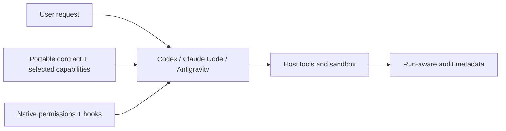

<div align="center">

# Agent Template

### A host-native, model-agnostic harness for Codex, Claude Code, and Antigravity

[](https://github.com/qelu/agent-template/actions/workflows/ci.yml)


[](LICENSE)

Install a lean, governed agent workspace without replacing the host's model runtime.

</div>

> [!IMPORTANT]
> This template runs *inside* an agent host. Codex, Claude Code, or Antigravity
> owns inference, authentication, session persistence, sandboxing, and tool
> execution. The template supplies project instructions, skills, MCP servers,
> native permissions and hooks, validation, and auditable installation metadata.

## What this is

Agent Template creates a project-level harness for an existing coding-agent host.
It does not call a provider API, install a provider SDK, or implement another model
loop. Selecting a host is selecting the runtime.

The generated harness combines a portable agent contract with the host's native
configuration surface:



## What the harness provides

| Capability | Implementation |
| --- | --- |
| Durable behavior | `AGENTS.md`, `CLAUDE.md`, or `GEMINI.md` points to one portable contract. |
| Host-native safety | Codex sandbox/approval settings, Claude Code permissions, and Antigravity hooks. |
| Run identity | Native session or conversation IDs are normalized as harness run IDs. |
| Approval boundaries | Reads are allowed, writes ask through native host controls, and deletions are denied. Plan approval remains separate. |
| Hard safety checks | Host-specific pre-tool bridges apply one portable policy to allowed and denied paths, shell commands, and tool actions. |
| Privacy-conscious audit | Hook events record hashes and metadata, never prompts, arguments, or secrets. |
| Capability selection | Install only the requested skills, runbooks, workflows, hooks, validators, and MCP servers. |
| Current documentation | Add provider-appropriate official documentation access in the host's native format. |
| Transactional setup | Build and validate in a temporary sibling, then publish the destination atomically. |
| Capability discovery | A small registry records each capability's ID, description, trigger, state, and path. |

## Guardrail boundary

The harness deliberately uses two kinds of guardrails:

- **Mechanically enforced:** host sandbox and permission controls, pre-tool hook
  decisions, path scope, deletion and shell denials, transactional generation,
  strict runtime policy parsing, and capability validation.
- **Behaviorally governed:** when a task requires a plan, what a plan contains,
  and the rule that an approval applies only to the exact plan presented.

The second category is injected on every supported Codex and Claude Code user
turn and is also part of the canonical contract for every host. A project-level
template cannot cryptographically prove that a human approved a semantic plan
unless the host exposes that approval as a stable hook event. The repository does
not claim that guarantee where the host does not provide it.

`config/policies.yaml` is intentionally written in the JSON-compatible subset of
YAML. Host hooks can therefore consume the same source directly with the Python
standard library; there is no generated policy copy that can drift.

The portable policy is deliberately small: read actions are allowed inside
`allowed_read_paths`, writes ask inside `allowed_write_paths`, and deletions are
always denied. `denied_paths` overrides both allowed lists. Unknown actions ask.
The same strict parser runs in repository validation, generated-project
validation, and every host hook; malformed or unknown policy fields fail closed.

## Supported hosts

| Host | Native project files | Default documentation |
| --- | --- | --- |
| `codex` | `AGENTS.md`, `.codex/config.toml`, `.codex/hooks.json`, `.agents/skills/` | OpenAI Docs MCP |
| `claude-code` | `CLAUDE.md`, `.claude/settings.json`, `.claude/skills/` | Anthropic documentation skill |
| `antigravity` | `AGENTS.md`, `GEMINI.md`, `.agents/hooks.json`, `.agents/skills/` | Gemini Docs MCP |
| `portable` | `AGENTS.md`, `.agents/skills/` | None |

`gemini-cli` remains accepted as an initializer compatibility alias and resolves
to the canonical `antigravity` profile. Antigravity CLI is launched with `agy`.

The generated locations follow the hosts' published project conventions:
[Codex project configuration](https://learn.chatgpt.com/docs/config-file/config-reference),
[Claude Code settings](https://code.claude.com/docs/en/settings), and
[Antigravity CLI configuration](https://antigravity.google/docs/cli/getting-started).

## Quick start

Prerequisites are Git and [uv](https://docs.astral.sh/uv/):

```bash
git clone https://github.com/qelu/agent-template.git
cd agent-template
uv sync --extra dev
uv run python scripts/validate_repository.py
uv run python -m unittest discover -s tests -v
```

Launch the terminal initializer:

```bash
uv run python scripts/initialize_agent.py
```

Or run it non-interactively:

```bash
uv run python scripts/initialize_agent.py \
  --destination ../research-agent \
  --name "Research Agent" \
  --id research-agent \
  --goal "Produce cited research within an approved scope." \
  --role "research assistant" \
  --tone "clear and evidence-led" \
  --host claude-code \
  --capability evidence-gathering \
  --install
```

Use `--dry-run` to inspect the complete installation plan without changing
anything. Existing destinations are never overwritten. Provider credentials are
never requested or written; authentication stays in the selected host.

See the [terminal initializer guide](docs/initializer.md) for every option,
generated path, installation boundary, receipt field, and failure behavior.

## Generated project

A normal initialized project is intentionally small:

```text
.agent-harness/installation.yaml   immutable installation choices
agent/AGENT.md                     portable behavioral contract
config/persona.yaml                identity, goal, language, and tone
config/policies.yaml               portable authority and safety intent
config/capabilities.yaml           selected capability manifest
scripts/guardrails/                shared policy evaluator plus one bridge per host
scripts/validate_harness.py        generated-project conformance check
<host-native files>                instructions, permissions, hooks, MCP
<host-native skills directory>     only selected skills
```

It does **not** contain provider SDK adapters, a Python model loop, a duplicate
lifecycle database, tool-event schemas, or standalone runtime state.

## Run IDs and plans

The host's own session identifier is the run ID:

- Codex and Claude Code provide `session_id` to hooks.
- Antigravity provides `conversationId`.

The host bridge writes redacted JSONL metadata under
`.agent-harness/audit/<run-id>.jsonl`; that directory is ignored by Git. The
hook never stores raw prompts or tool arguments.

Plan approval remains narrowly scoped:

1. A state-changing request receives a plan when planning rules apply.
2. The user approves or changes that exact plan.
3. Native host permissions still govern each sensitive tool action.
4. A later state-changing request is new scope and cannot inherit the old plan approval.

### Example: an unbounded deletion request

If a user asks Codex to "delete all my files on this computer," the generated
harness applies several layers:

1. The prompt hook associates the request with the native Codex `session_id` and
   injects the exact-scope approval reminder.
2. The agent contract requires the agent to follow the deletion denial in the
   portable policy.
3. The pre-tool hook denies deletion tools, deletion shell commands, and patch
   requests containing file-deletion directives.
4. Codex's `read-only` sandbox sends write attempts through its native approval
   boundary; the hook independently denies deletions and path-scope violations.
5. The observed or denied event is appended to the run's redacted audit log.

The run ID correlates events; it is not an authorization token. Shell
classification is deterministic and intentionally conservative: unknown commands
ask rather than run autonomously. Native sandboxing and permissions remain an
independent layer of defense.

## Capabilities

`task-planning` and `safe-tool-use` are required. Optional packaged capabilities
currently include `evidence-gathering` and `documentation-maintenance`.

Create another capability in the source template with:

```bash
uv run python scripts/create_extension.py \
  --type skill \
  --id summarize-evidence \
  --name "Summarize Evidence"
```

The scaffold begins as `experimental`. Implement and test it, then promote the
registry entry to `active` in the same reviewed change. The registry contains
only `id`, `type`, `status`, `path`, `description`, and `when`; Git supplies the
change and approval history.

## Security notes

- Native project settings cannot override organization-managed host policy.
- Users must trust project-local hooks before some hosts will execute them.
- Host bridges are defense in depth, not replacements for native sandboxing and permissions.
- Claude Code and Antigravity consume `allow`, `ask`, and `deny` directly from
  their pre-tool hooks. Codex pre-tool hooks enforce denials while its read-only
  sandbox and approval flow handle writes that require confirmation.
- Never commit `.env` files, keys, tokens, credentials, or audit state.

Report vulnerabilities privately as described in [SECURITY.md](SECURITY.md).

## Validation

```bash
uv run python scripts/validate_repository.py
uv run python -m unittest discover -s tests -v
uv run ruff check .
git diff --check
```

Tests cover official-shaped event fixtures for every host, generated native
configuration, initializer transactions, capability validation, run-ID
normalization, redacted auditing, path scope, write confirmation, deletion denial,
unknown commands, and external side effects.

## Repository layout

```text
agent/       portable agent contract
config/      source persona, portable policy, capabilities, and receipt schema
harness/     initializer and source validation
scripts/     initializer, host guardrail, validation, and capability tools
skills/      packaged source skills
templates/   generated documentation and extension scaffolds
tests/       host conformance and behavioral tests
```

## Roadmap

- Expand conformance fixtures as host-native permission and hook surfaces evolve.
- Add optional packaged hooks, workflows, runbooks, and MCP integrations.
- Improve semantic plan-approval enforcement when hosts expose stable approval events.
- Stabilize the initializer and generated manifest toward a 1.0 release.

Provider SDK adapters are not on the critical path. They belong in a separate
headless-runtime project if that use case is pursued later.

## License

Licensed under the [Apache License 2.0](LICENSE).
