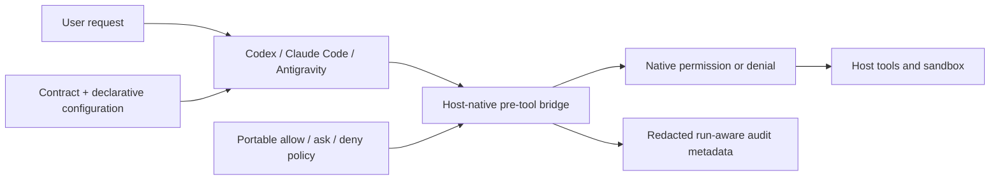

<div align="center">

# Agent Template

### A host-native, model-agnostic harness for Codex, Claude Code, and Antigravity

[](https://github.com/qelu/agent-template/actions/workflows/ci.yml)


[](LICENSE)

Install a lean, governed agent workspace without replacing the host's model runtime.

</div>

> [!IMPORTANT]
> This template runs *inside* an agent host. Codex, Claude Code, or Antigravity
> owns inference, authentication, session persistence, sandboxing, and tool
> execution. The template supplies project instructions, skills, MCP servers,
> native permissions and hooks, validation, and auditable installation metadata.

## What this is

Agent Template creates a project-level harness for an existing coding-agent host.
It does not call a provider API, install a provider SDK, or implement another model
loop. Selecting a host is selecting the runtime.

It is intended for developers and teams that need portable, auditable,
least-authority behavior across coding-agent hosts. It favors explicit policy,
review boundaries, and reproducible validation over the simplicity of a quick
single-host script. It is not a provider SDK, model runtime, or autonomous-agent
framework.

The generated harness combines a portable agent contract with the host's native
configuration surface:



## What the harness provides

| Capability | Implementation |
| --- | --- |
| Durable behavior | `AGENTS.md`, `CLAUDE.md`, or `GEMINI.md` points to one portable contract. |
| Host-native safety | Codex sandbox/approval settings, Claude Code permissions, and Antigravity hooks. |
| Run identity | Native session or conversation IDs are normalized as harness run IDs. |
| Approval boundaries | Reads are allowed, writes ask through native host controls, and deletions are denied. Plan approval remains separate. |
| Hard safety checks | Host-specific pre-tool bridges apply one portable policy to allowed and denied paths, shell commands, and tool actions. |
| Privacy-conscious audit | Hook events record hashes and metadata, never prompts, arguments, or secrets. |
| Capability selection | Install the required core skills plus only the optional capabilities selected by the user. |
| Integration selection | Opt into host-compatible external services without embedding credentials. |
| Current documentation | Add provider-appropriate official documentation access in the host's native format. |
| Transactional setup | Build and validate in a temporary sibling, then publish the destination atomically. |
| Capability discovery | A small registry records each capability's ID, description, trigger, state, and path. |

## Guardrail boundary

The harness deliberately uses two kinds of guardrails:

- **Mechanically enforced:** host sandbox and permission controls, pre-tool hook
  decisions, path scope, deletion and shell denials, transactional generation,
  strict runtime policy parsing, and capability validation.
- **Behaviorally governed:** when a task requires a plan, what a plan contains,
  and the rule that an approval applies only to the exact plan presented.

The second category is injected through `UserPromptSubmit` for Codex and Claude
Code and through `PreInvocation` for Antigravity. It is also part of the canonical
contract for every host. A project-level template cannot cryptographically prove
that a human approved a semantic plan unless the host exposes that approval as a
stable hook event. The repository does not claim that guarantee where the host
does not provide it.

`config/policies.yaml` is intentionally written in the JSON-compatible subset of
YAML. Host hooks can therefore consume the same source directly with the Python
standard library; there is no generated policy copy that can drift.

The portable policy is deliberately small: read actions are allowed inside
`allowed_read_paths`, writes ask inside `allowed_write_paths`, and deletions are
always denied. `denied_paths` overrides both allowed lists. Unknown actions ask.
The same strict parser runs in repository validation, generated-project
validation, and every host hook; malformed or unknown policy fields fail closed.

The three layers remain independent:

| Layer | Source | Responsibility |
| --- | --- | --- |
| Contract | `agent/AGENT.md` | Stable operating principles, authority, and instruction precedence. |
| Configuration | `config/persona.yaml`, `config/policies.yaml`, `config/capabilities.yaml`, `config/integrations.yaml` | Declarative identity, action policy, path scope, capability discovery, and external-service selection. |
| Enforcement | Native host settings plus `scripts/guardrails/*.py` | Parse native events and mechanically apply the portable policy. |

The root `AGENTS.md`, `CLAUDE.md`, and `GEMINI.md` files generated for a host are
entry points to the canonical contract, not additional contract sources.

### Portable action decisions

| Action | Default | Scope behavior |
| --- | --- | --- |
| Read | `allow` | Only within `allowed_read_paths`; `denied_paths` still blocks. |
| Write | `ask` | Only within `allowed_write_paths`; outside scope is denied. |
| Delete | `deny` | Cannot be authorized by a chat or native permission prompt. |
| External side effect | `ask` | Continues through the host's native permission flow. |
| Unknown | `ask` | Conservative fallback when the evaluator cannot prove an action is read-only. |

Claude Code and Antigravity can return all three decisions directly from
`PreToolUse`. Codex's `PreToolUse` bridge returns hard denials; its generated
`read-only` sandbox with `approval_policy = "on-request"` supplies the native
confirmation boundary for writes and other actions classified as `ask`.

## Supported hosts

| Host | Native project files | Default documentation |
| --- | --- | --- |
| `codex` | `AGENTS.md`, `.codex/config.toml`, `.codex/hooks.json`, `.agents/skills/` | OpenAI Docs MCP |
| `claude-code` | `CLAUDE.md`, `.claude/settings.json`, `.claude/skills/` | Anthropic documentation skill |
| `antigravity` | `AGENTS.md`, `GEMINI.md`, `.agents/hooks.json`, `.agents/skills/` | Gemini Docs MCP |
| `portable` | `AGENTS.md`, `.agents/skills/` | None |

`gemini-cli` remains accepted as an initializer compatibility alias and resolves
to the canonical `antigravity` profile. Antigravity CLI is launched with `agy`.

The generated locations follow the hosts' published project conventions:
[Codex project configuration](https://learn.chatgpt.com/docs/config-file/config-reference),
[Claude Code settings](https://code.claude.com/docs/en/settings), and
[Antigravity CLI configuration](https://antigravity.google/docs/cli/getting-started).

## Quick start

Install every mandatory prerequisite before launching the initializer:

- [Git](https://git-scm.com/downloads), available as `git` on `PATH`.
- [Python](https://www.python.org/downloads/) 3.11 or newer.
- [uv](https://docs.astral.sh/uv/getting-started/installation/), available as `uv` on `PATH`.
- [Gitleaks](https://github.com/gitleaks/gitleaks#installing), available as `gitleaks` on `PATH`.

The initializer performs this preflight before opening the wizard and exits without
creating or changing a harness if any prerequisite is missing. Verify them with:

```bash
git --version
python --version
uv --version
gitleaks version
```

Then prepare and validate the template:

```bash
git clone https://github.com/qelu/agent-template.git
cd agent-template
uv sync --extra dev
uv run python scripts/validate_repository.py
uv run python -m unittest discover -s tests -v
```

Launch the terminal initializer:

```bash
uv run python scripts/initialize_agent.py
```

Or run it non-interactively:

```bash
uv run python scripts/initialize_agent.py \
  --destination ../research-agent \
  --name "Research Agent" \
  --id research-agent \
  --goal "Produce cited research within an approved scope." \
  --role "research assistant" \
  --tone "clear and evidence-led" \
  --host claude-code \
  --capability evidence-gathering \
  --integration atlassian-rovo \
  --install
```

Use `--dry-run` to inspect the complete installation plan without changing
anything. New and existing empty destinations are supported; existing files are
never overwritten. Provider credentials are never written into the generated project.
For Google Workspace, the initializer copies a user-supplied Desktop or Web OAuth client
to a private user directory and configures the pinned community MCP for the selected host.

See the [terminal initializer guide](docs/initializer.md) for every option,
generated path, installation boundary, receipt field, and failure behavior.

## Generated project

A normal initialized project is intentionally small:

```text
.agent-harness/installation.yaml   installation choices and skill-import provenance
agent/AGENT.md                     portable behavioral contract
config/persona.yaml                identity, goal, language, and tone
config/policies.yaml               portable authority and safety intent
config/capabilities.yaml           selected capability manifest
config/integrations.yaml           selected external-integration manifest
scripts/guardrails/                shared policy evaluator plus one bridge per host
scripts/update_scope.py            host-independent project-scope launcher
scripts/validate_harness.py        generated-project conformance check
<host-native files>                instructions, permissions, hooks, MCP
<host-native skills directory>     required skills and selected optional skills
```

It does **not** add a second model runtime or a parallel lifecycle system. The
selected host remains responsible for inference, authentication, sessions,
sandboxing, and tool execution.

## Run IDs and plans

The host's own session identifier is the run ID:

- Codex and Claude Code provide `session_id` to hooks.
- Antigravity provides `conversationId`.

The host bridge writes redacted JSONL metadata under
`.agent-harness/audit/<run-id>.jsonl`; that directory is ignored by Git. The
hook never stores raw prompts or tool arguments.

Plan approval remains narrowly scoped:

1. A state-changing request receives a plan when planning rules apply.
2. The user approves or changes that exact plan.
3. Native host permissions still govern each sensitive tool action.
4. A later state-changing request is new scope and cannot inherit the old plan approval.

### Example: an unbounded deletion request

If a user asks Codex to "delete all my files on this computer," the generated
harness applies several layers:

1. The prompt hook associates the request with the native Codex `session_id` and
   injects the exact-scope approval reminder.
2. The agent contract requires the agent to follow the deletion denial in the
   portable policy.
3. The pre-tool hook denies deletion tools, deletion shell commands, and patch
   requests containing file-deletion directives.
4. Codex's `read-only` sandbox sends write attempts through its native approval
   boundary; the hook independently denies deletions and path-scope violations.
5. The policy outcome is appended to the run's redacted audit log.

The run ID correlates events; it is not an authorization token. Shell
classification is deterministic and intentionally conservative: unknown commands
ask rather than run autonomously. Native sandboxing and permissions remain an
independent layer of defense.

## Capabilities

Every generated harness includes these required skills:

- `task-planning` and `safe-tool-use` for bounded work and tool authority;
- `manage-project-scope` for adding project directories without weakening denied paths;
- `map-skill-command` for creating short aliases for installed skills;
- `skill-auditor` for static inspection without executing candidate content;
- `import-external-skill` for explicit imports from immutable external sources; and
- `import-template-skills` for manually importing only genuinely new skills from stable
  tagged template releases.

Optional packaged capabilities currently include `evidence-gathering`,
`documentation-maintenance`, `post-work-review`, `dependency-change-review`,
`incident-triage`, the `incident-response` and `integration-lifecycle` runbooks,
the `pre-commit-secret-scan` hook, and `devoteam-branding`. The
post-work review examines ADRs, debt, skills, hooks, policies, runbooks,
configuration, tests, integrations, and user documentation after material work,
then separates required maintenance from proposed new scope. The branding skill applies,
rebrands, or audits business artifacts using current authenticated Devoteam sources
when available; this public repository does not embed private assets or links. The
wizard preselects the optional defaults in `config/initializer.yaml` so users can
deselect any they do not want. In non-interactive mode, omitting `--capability`
preserves those defaults; supplying the flag one or more times selects only those
optional IDs. Named bundles are transparent shortcuts for related capabilities and
integrations; their expanded selections appear in the dry-run plan and receipt.

## External integrations

`config/integrations.yaml` is a separate, optional catalog for remote and local MCP servers,
provider CLIs, and host plugins. The initializer offers only active entries
compatible with the selected host. Use `--integration ID` or `--bundle ID` to opt in.
Generated projects contain the selected manifest and `docs/integrations.md`. Credentials
are never copied into the project. Selecting Google Workspace validates a Desktop OAuth
client, or a Web client with `http://localhost:8000/oauth2callback`, stores it in a private
user directory, and configures `workspace-mcp==1.25.0` over stdio for Codex, Claude Code,
or Antigravity. Authentication completes on the first Workspace tool call.
Because Antigravity 2.0 discovers MCP servers from its shared Gemini configuration, an
Antigravity installation also backs up and atomically merges only the selected server
definitions into `~/.gemini/config/mcp_config.json`. Unrelated servers are preserved,
conflicting definitions fail closed, and the generated harness allowlist still controls
which shared MCPs the project may invoke.

The initial provider catalog contains:

- Atlassian Rovo MCP for Jira, Confluence, Jira Service Management, and Bitbucket,
  using Atlassian's current OAuth 2.1 endpoint on every concrete host;
- GitHub's official remote MCP on Codex and Claude Code, using only the
  `GITHUB_PERSONAL_ACCESS_TOKEN` environment variable for a narrowly scoped token; and
- Taylor Wilsdon's community Google Workspace MCP, pinned and locally launched for
  Gmail, Drive, Calendar, Docs, Sheets, Slides, Forms, Tasks, Contacts, Chat, and Apps Script.

The `governance`, `operations`, and `team-baseline` bundles provide transparent
shortcuts over the provider-neutral catalog. The staged-secret hook is optional,
uses the official Gitleaks command, requires Gitleaks to be present or explicitly
installed, and configures only the generated repository's local Git hooks path.

From a generated harness, project scope can be updated consistently on every host:

```bash
python3 scripts/update_scope.py \
  --root /path/to/harness \
  --path /path/to/project \
  --access read
```

Use `read-write` only when the agent must modify the added project. Template and
external skill imports are manually triggered; neither importer runs on a schedule
or updates, merges, or overwrites an installed capability or existing skill directory.

Create another capability in the source template with:

```bash
uv run python scripts/create_extension.py \
  --type skill \
  --id summarize-evidence \
  --name "Summarize Evidence"
```

The scaffold begins as `experimental`. Implement and test it, then promote the
registry entry to `active` in the same reviewed change. The registry contains
only `id`, `type`, `status`, `path`, `description`, and `when`; Git supplies the
change and approval history.

## Security notes

- Native project settings cannot override organization-managed host policy.
- Users must trust project-local hooks before some hosts will execute them.
- Host bridges are defense in depth, not replacements for native sandboxing and permissions.
- Generated hooks deny MCP servers outside the harness's explicit execution allowlist even
  when a host exposes globally configured servers to the project.
- Claude Code and Antigravity consume `allow`, `ask`, and `deny` directly from
  their pre-tool hooks. Codex pre-tool hooks enforce denials while its read-only
  sandbox and approval flow handle writes that require confirmation.
- Never commit `.env` files, keys, tokens, credentials, or audit state.

Report vulnerabilities privately as described in [SECURITY.md](SECURITY.md).

## Validation

```bash
uv run python scripts/validate_repository.py
uv run python -m unittest discover -s tests -v
uv run ruff check .
uv run mypy harness scripts tests
uv lock --check
git diff --check
```

Tests cover official-shaped event fixtures for every host, generated native
configuration, initializer transactions, capability validation, run-ID
normalization, redacted auditing, path scope, write confirmation, deletion denial,
unknown commands, and external side effects.

## Repository layout

```text
agent/       portable agent contract
config/      source persona, policy, capabilities, integrations, and receipt schema
harness/     initializer and source validation
scripts/     initializer, host guardrail, validation, and capability tools
skills/      packaged source skills
templates/   generated documentation and extension scaffolds
tests/       host conformance and behavioral tests
```

## Roadmap

- Expand conformance fixtures as host-native permission and hook surfaces evolve.
- Expand the optional catalog with reviewed hooks, workflows, runbooks, and
  provider integrations.
- Improve semantic plan-approval enforcement when hosts expose stable approval events.
- Broaden release-upgrade coverage while preserving locally changed skills.

## Compatibility and releases

The [compatibility policy](docs/compatibility.md) inventories the documented 1.x
interfaces, host and hook contracts, deprecation rules, and migration guarantees.
The `harness` package remains an internal implementation detail rather than a
supported Python import API. Maintainers use the [release process](docs/releasing.md)
to collect compatibility, validation, security, and publication evidence.

## License

Licensed under the [Apache License 2.0](LICENSE).
